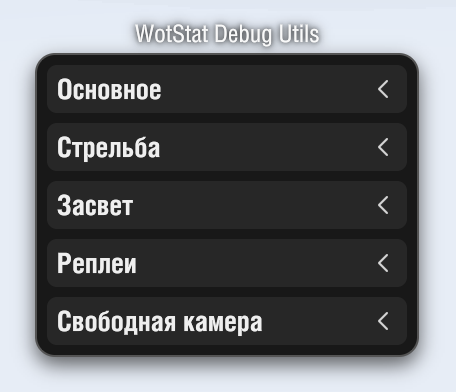

### | RU | [EN](./README_EN.md) |

# WotStat Debug Utils

> [!CAUTION]
> Некоторые функции мода могут добавить нечестное преимущество в бою. Поэтому мод будет работать только в `Реплеях`, `Тренировочных боях`, `Топографии` и `Ангаре`. В соревновательных режимах (Случайные, Клановые, Командные бои) мод не будет работать.

## Установка
1. Скачайте файл мода `wotstat.debug-utils_1.0.0.mtmod` и служебную библиотеку `net.openwg.gameface_1.0.0.mtmod`.
2. Поместите их в папку `Tanki/mods/{АКТУАЛЬНАЯ_ВЕРСИЯ_ИГРЫ}/`.
3. Запустите игру и нажмите `F2` для открытия окна мода.

## Общий функционал мода
Окно мода разделено не несколько разделов.

### Основное
- `Серверное время` – отображает текущее время сервера в секундах (три знака после запятой). 

#### Raycast
- `Дистанция до курсора` – отображает расстояние от камеры до точки, на которую указывает курсор.
- `Создавать линию (СКМ)` – при нажатии Средней Кнопки Мыши (СКМ) будет создаваться линия от камеры до точки, на которую указывает курсор.
  - `Информация о поверхности` – отображает информацию о поверхности, которую пересекает луч, отображается расстояние от камеры до этой точки, и если это танк, то отображается броня и угол входа.

#### Физика
- `Столкновения со статикой` – отображает события столкновений с различными объектами (поломки деревьев, заборчиков, тараны) и направление силы которое замедляет танк в небольшом радиусе от танка.
  - `Инфо текст` – отображает текстовую информацию о столкновении, энергию, урон и флаги.
  - `Для всех танков` – отображает столкновения для всех танков на карте, а не только для вашего. (но работает всё ещё в небольшом радиусе от вашего танка)
  

#### BBox
- `Для своего танка` – отображает ограничивающий бокс для компонентов вашего танка.
- `Для всех танков` – отображает ограничивающий бокс для компонентов всех танков на карте.
- `Сквозная видимость` – отображает линии бокса даже если они находятся за другими объектами.

- `Зелёный` – гусеницы
- `Жёлтый` – корпус
- `Голубой` – башня (то что вращается вправо-влево)
- `Фиолетовый` – орудие (то что вращается вверх-вниз)
- `Оранжевый` – дополнительные гусеницы (на некоторых танках)

### Стрельба

#### Прицеливание
- `Серверный маркер` – отображает фактический круг разброса в точке прицеливания (в 3D пространстве). Этот маркер отображает последнее актуальное значение пришедшее от сервера (без сглаживание, с фактической частотой тикрейта).
  - `Траектория` – отображает траекторию к маркеру (в реплеях может не совпадать, тк позиция маркера и траектория берутся из разных мест).
- `Клиентский маркер` – отображает круг разброса в точке прицеливания, который рассчитывается на клиенте (без сглаживания).
  - `Траектория` – отображает траекторию к маркеру.
- `Продолжать траекторию` – нужно ли продолжать траекторию за маркером.
- `Сохранять после выстрела` – сохранять маркеры и траектории в момент выстрела (появление трассера) на 5 секунд.

#### Выстрел
- `Траектория` – отображает траекторию трассера.
  - `Шаг в 1 тик` – отображает линию от текущей позиции снаряда к его позиции 1 тик вперёд (то есть то, где снаряд находится на сервер в этот момент).
  - `Продолжать траекторию` – нужно ли продолжать траекторию после точки завершения трассера.
  - `Маркер выстрела` – отображает маркер в точке, где запрос выстрела отправился на сервер (после появления трассера, рядом с маркером отображается текст с временем задержки между отправкой запроса и появлением трассера).
  - `Маркер попадания` – отображает маркер в точке, где снаряд ударился о поверхность или попал в танк. Этот же маркер завершает траекторию трассера.
  - `Маркер снаряда` – отображает текущее положение снаряда с момента появления трассера. Учтите, что он может существенно отличаться от визуального эффекта снаряда. Визуальный эффект не соответствует ни реальному положению снаряда ни его скорости, он привязывается к концу ствола и пытается художественно изобразить полёт снаряда.
- `Сдвиг тиков` – добавляет отступ в указанное число тиков для снаряда на траектории. (Например при задержке в 1 тик, в момент появления трассера, снаряд будет отображаться на позиции через 1 тик от начала).
- `Длительность` – длительность отображения траектории и маркера выстрела после появления трассера.

> Формат текстов у маркера `Событие {дистанция по траектории}m/{время по траектории}s ({время события}s)`.  
> То есть `Hit 83.3m/0.220s (0.104s)` означает, что с момента появления трассера прошло `0.104 секунды`, а точка находится на расстоянии `83.3 метра` по траектории, которую снаряд прошел бы за `0.220 секунд`.

Описание ситуации на скриншоте

- выстрел был отправлен на сервер за `0.097 секунд` до появления трассера
- через `0.104 секунды` после появления трассера, пришла информация о попадании в танк на расстоянии `83.3 метра` по траектории от точки выстрела, это попадание должно случиться через `0.220` секунд полёта снаряда. И в этот же момент пришел результат попадания – рикошет
- через `0.199 секунд` после появления трассера, пришла информация о столкновении рикошета со стеной на расстоянии `25.2 метра` по траектории рикошета и `109.2 метра` с учётом полёта снаряда от точки выстрела.

### Засвет
- `Обзорные точки` – отображает обзорные точки танков, которые используются для засвета. Они также совпадают с габаритными и перекрывают их.
- `Габаритные точки` – отображает габаритные точки танков, которые используются для засвета.
- `Отображать BBox` – отображает ограничивающий бокс который используется для габаритных точек (первые 4 точки находятся на центрах боковых граней, а 5 точка находится на верхней грани по центру танка).
  - `Привязка центров` – отображает диагональные линии на гранях, пересечение которых является центром грани, на котором находится габаритная точка.

#### Лучи
- `Засвета СВОЕГО танка` - отображает обзорные лучи от вашего танка к габаритным точкам противников.
- `Маскировки СВОЕГО танка` - отображает маскировочные лучи от противников к габаритным точкам вашего танка.
- `Засвета ВСЕХ танков` - отображает обзорные лучи от всех союзников ко всем противникам.
- `Маскировки ВСЕХ танков` - отображает маскировочные лучи от всех противников ко всем союзникам.
- `Текст мин. дистанции` – рядом с каждой точкой отображает текстовый маркер с минимальной дистанцией луча выходящего из этой точки.
- `Только кратчайшие лучи` – отображает только лучи, которые являются кратчайшими для каждой пары танков. (например, если у вас есть 3 противника, то будет отображаться только 3 обзорных луча от вашего танка к каждому противнику и 3 маскировочных луча к вашему)
- `Отображать непрямые` – отображает лучи, которые пересекают препятствия (такие лучи не могут засветить танк). Эти лучи отображаются бледным цветом.

### Реплеи
- `Расширенное замедление` – добавляет шаги замедления в `1/32`, `1/64` и `1/128` от реальной скорости.
- `Пауза на СВОЙ выстрел` – при выстреле вашего танка, реплей будет автоматически ставиться на паузу.
- `Пауза на ЛЮБОЙ выстрел` – при выстреле любого танка, реплей будет автоматически ставиться на паузу.

### Свободная камера
Работает и в ангаре и в бою.

- `Включить` – включает свободную камеру
- `Разрешить стрельбу` – разрешает стрелять из танка на ЛКМ при включенной свободной камере.

Управление камерой отличается от игровой свободной камеры:
- `WASD` – перемещение камеры вперёд, влево, назад и вправо на одной высоте.
- `Пробел` – перемещение камеры вверх.
- `Shift` – перемещение камеры вниз.
- `Z` – приближение (изменение FOV камеры).
- `Z + колёсиком мышки` – изменение приближения во время зума.