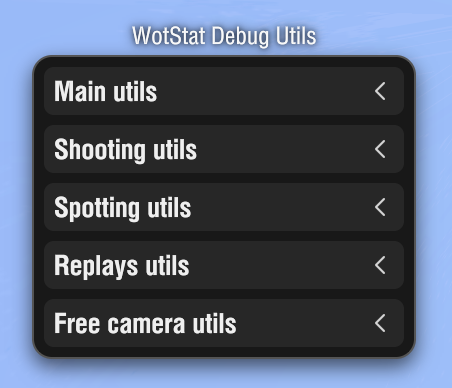
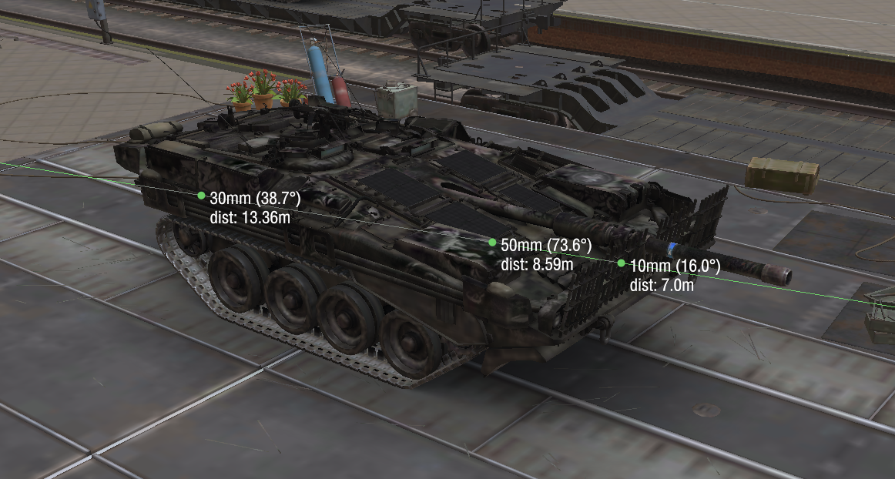
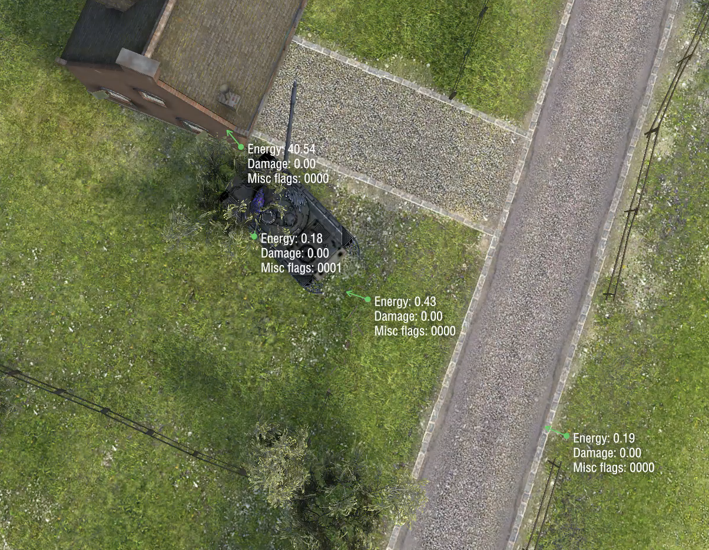
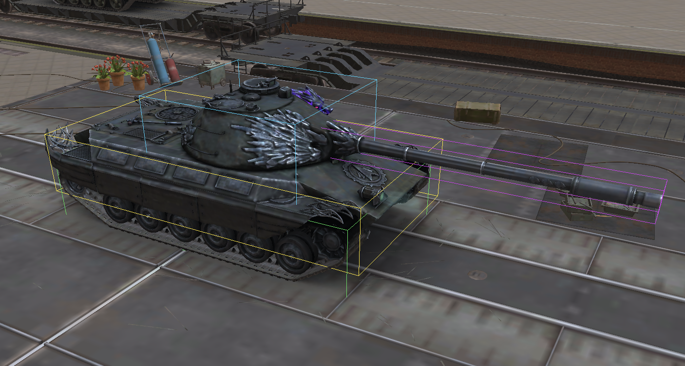
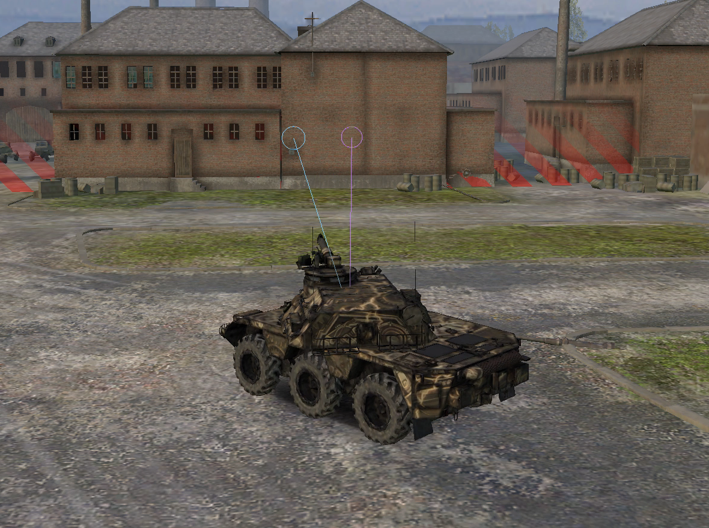
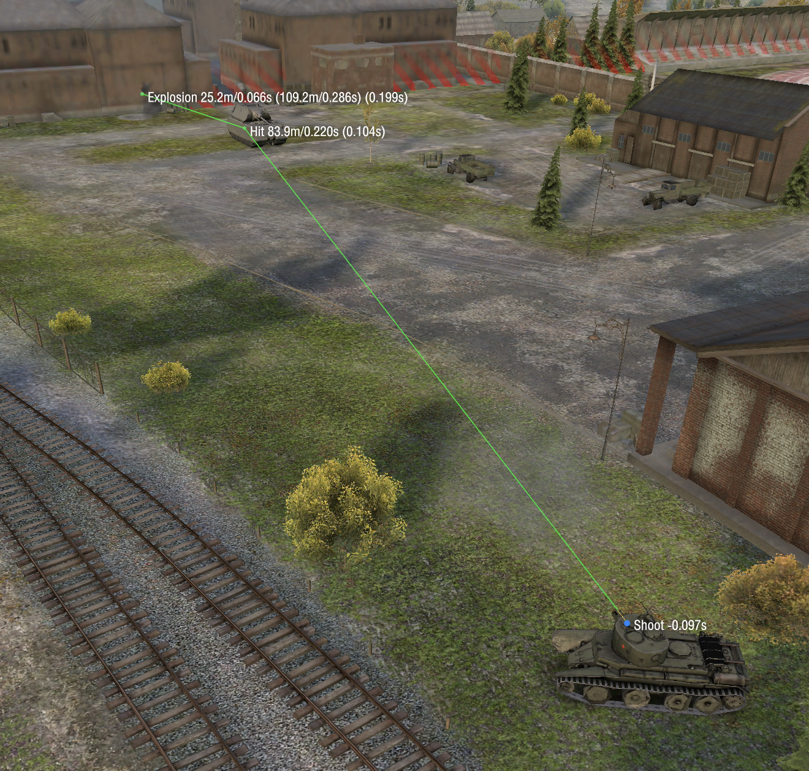
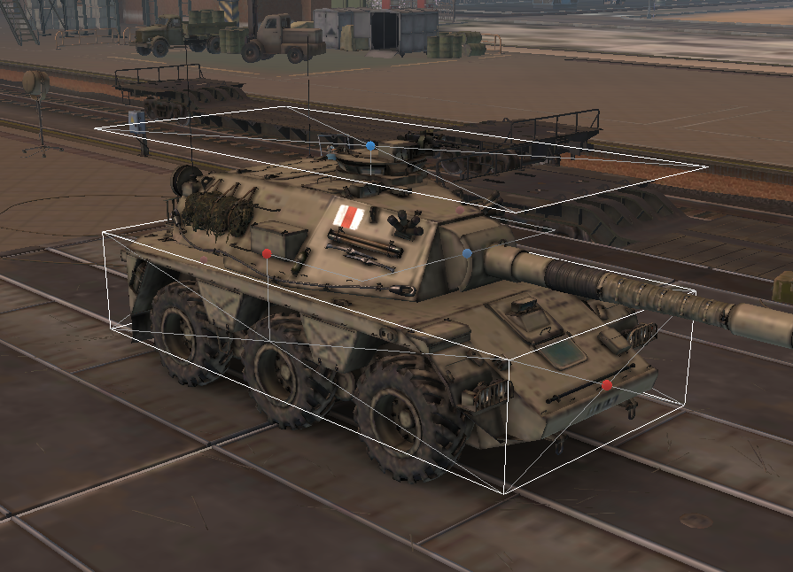
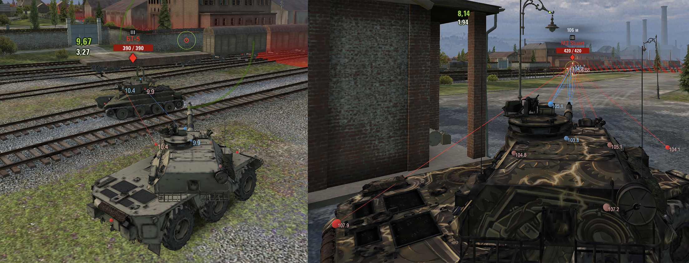

### | [RU](./README.md) | EN |

# WotStat Debug Utils

> [!CAUTION]
> Some features of the mod may provide an unfair advantage in battle. For that reason, the mod only works in `Replays`, `Training Rooms`, `Topography`, and the `Garage`. In competitive modes (`Random Battles`, `Clan Battles`, `Team Battles`), the mod is disabled.

## Installation
1. Download the mod file [`wotstat.debug-utils_1.0.0.wotmod`](https://github.com/wotstat/wotstat-debug-utils/releases/latest) and the helper library [`net.openwg.gameface_1.1.6.wotmod`](https://gitlab.com/openwg/wot.gameface/-/releases).
2. Put both files into `Tanki/mods/{CURRENT_GAME_VERSION}/`.
3. Launch the game and press `F2` to open the mod window.

## General mod functionality
The mod window is divided into several sections.

### Main utils
- `Server time` — displays the current server time in seconds (with three decimal places).

#### Raycast
- `Cursor distance` — displays the distance from the camera to the point under the cursor.
- `Raycast line (MMB)` — pressing the Middle Mouse Button (`MMB`) creates a line from the camera to the point under the cursor.
  - `Mat info` — displays information about the surface hit by the ray, including the distance from the camera to that point, and if it is a tank, its armor and impact angle.

#### Physics
- `Static collision events` — displays collision events with various static objects (fallen trees, fences, rams) and the direction of the force slowing the tank within a small radius around it.
  - `Info text` — displays textual collision information, including energy, damage, and flags.
  - `From all` — displays collisions for all tanks on the map, not just your own. (Still works only within a small radius around your tank.)

#### BBox
- `Show OWN bbox` — displays the bounding boxes of your tank’s components.
- `Show ANY bbox` — displays the bounding boxes of all tanks’ components on the map.
- `Backface visibility` — displays box lines even when they are behind other objects.

- `Green` — tracks
- `Yellow` — hull
- `Cyan` — turret (rotates left/right)
- `Purple` — gun (rotates up/down)
- `Orange` — additional tracks (present on some tanks)

### Shooting utils

#### Aiming
- `Server aiming circle` — displays the actual dispersion circle at the aiming point (in 3D space). This marker shows the last valid value received from the server (without smoothing, at the actual tickrate frequency).
  - `Trajectory` — displays the trajectory to the marker. (In replays it may not match exactly, since the marker position and trajectory are taken from different places.)
- `Client aiming circle` — displays the dispersion circle at the aiming point calculated on the client (without smoothing).
  - `Trajectory` — displays the trajectory to the marker.
- `Continuous trajectory` — whether to continue the trajectory beyond the marker.
- `Preserve on shot` — preserves markers and trajectories at the moment of the shot (when the tracer appears) for 5 seconds.

#### Projectile
- `Trajectory` — displays the tracer trajectory.
  - `1Tick interval` — displays a line from the current projectile position to its position 1 tick ahead (that is, where the projectile is on the server at that moment).
  - `Continuous trajectory` — whether to continue the trajectory beyond the tracer end point.
  - `Shoot marker` — displays a marker at the point where the shot request was sent to the server (after the tracer appears, a text label nearby shows the delay between sending the request and tracer appearance).
  - `End marker` — displays a marker at the point where the projectile hit a surface or a tank. This marker also marks the end of the tracer trajectory.
  - `Bullet marker` — displays the current projectile position starting from the moment the tracer appears. Note that it may differ significantly from the visual shell effect. The visual effect does not match either the real projectile position or its speed; it is attached to the gun barrel end and only tries to artistically represent the shell flight.
- `Compensate ticks` — adds an offset of the specified number of ticks to the projectile along the trajectory. (For example, with a 1-tick delay, when the tracer appears, the projectile will be displayed at the position 1 tick after the start.)
- `Duration` — how long the trajectory and shoot marker remain visible after the tracer appears.

> Marker text format: `Event {distance along trajectory}m/{time along trajectory}s ({event time}s)`  
> For example, `Hit 83.3m/0.220s (0.104s)` means that `0.104 seconds` have passed since the tracer appeared, and the point is located `83.3 meters` along the trajectory, which the projectile would travel in `0.220 seconds`.

Description of the situation in the screenshot

- the shot request was sent to the server `0.097 seconds` before the tracer appeared
- `0.104 seconds` after the tracer appeared, hit information was received for a tank at a distance of `83.3 meters` along the trajectory from the shot point; this hit should occur after `0.220 seconds` of projectile flight. At the same moment, the hit result was received — ricochet
- `0.199 seconds` after the tracer appeared, ricochet collision information was received for a wall at a distance of `25.2 meters` along the ricochet trajectory and `109.2 meters` including the projectile flight from the shot point

### Spotting utils
- `View range ports` — displays the view range points of tanks used for spotting. They coincide with and overlap the visibility checkpoints.
- `Visibility checkpoints` — displays the tank checkpoints used for spotting.
- `Show BBox` — displays the bounding box used for the visibility checkpoints (the first 4 points are at the centers of the side faces, and the 5th point is at the center of the top face of the tank).
  - `BBox align` — displays diagonal lines on the faces; their intersection marks the face center where the visibility checkpoint is located.

#### Rays
- `OWN spot rays` — displays spotting rays from your tank to enemy visibility checkpoints.
- `OWN mask rays` — displays camouflage rays from enemies to your tank’s visibility checkpoints.
- `ALL spot rays` — displays spotting rays from all allies to all enemies.
- `ALL mask rays` — displays camouflage rays from all enemies to all allies.
- `Min distance text` — displays a text marker near each point showing the minimum ray distance originating from that point.
- `Nearest only` — displays only rays that are the shortest for each tank pair. (For example, if you have 3 enemies, only 3 spotting rays from your tank to each enemy and 3 camouflage rays to your tank will be displayed.)
- `Show non direct` — displays rays that intersect obstacles (such rays cannot spot a tank). These rays are displayed in a faded color.

### Replays utils
- `Extend slow down` — adds slowdown steps of `1/32`, `1/64`, and `1/128` of real speed.
- `Pause on OWN shot` — automatically pauses the replay when your tank fires.
- `Pause on ANY shot` — automatically pauses the replay when any tank fires.

### Free camera utils
Works both in the Garage and in battle.

- `Enable` — enables the free camera.
- `Allow shooting` — allows firing the tank with `LMB` while free camera is enabled.

The camera controls differ from the in-game free camera:
- `WASD` — move the camera forward, left, backward, and right at the same height.
- `Space` — move the camera up.
- `Shift` — move the camera down.
- `Z` — zoom in (changes camera FOV).
- `Z + mouse wheel` — adjust zoom while zoomed in.